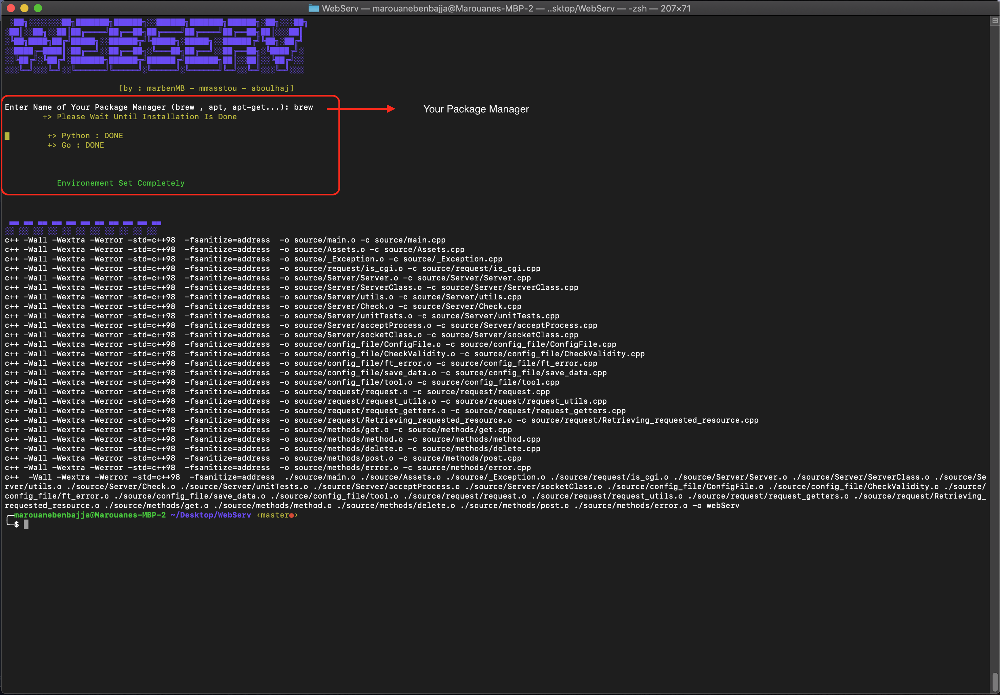
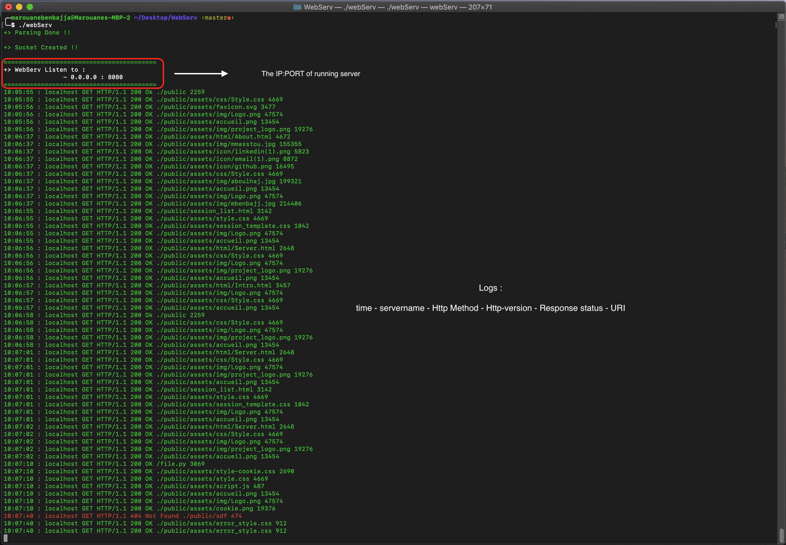
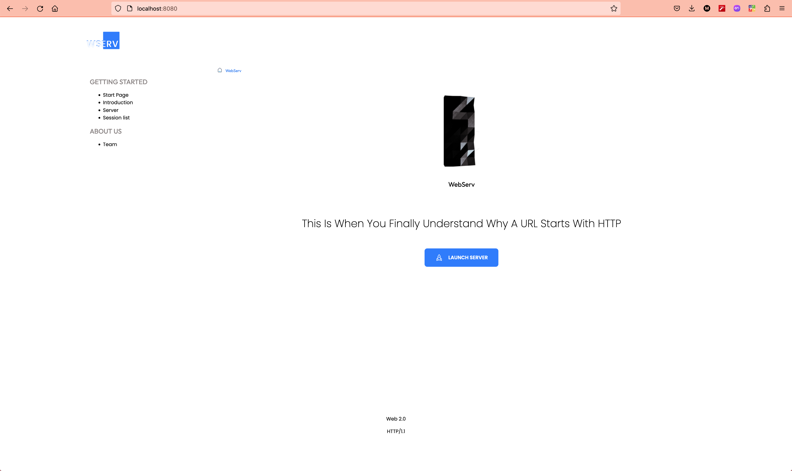
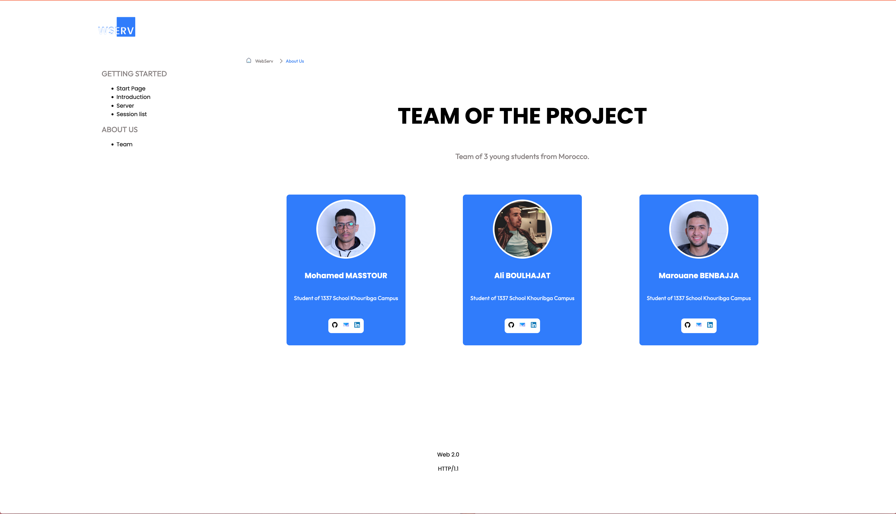

## webserv

an HTTP server in c++
<p align="center">
  
</p>

At the most basic level, whenever a browser needs a file that is hosted on a web server, the browser requests the file via HTTP. When the request reaches the correct (hardware) web server, the (software) HTTP server accepts the request, finds the requested document, and sends it back to the browser, also through HTTP.

HTTP server usually use TCP for communications.

## TCP socket programming
Socket : mechanism to give programs access to the network
- **create** a socket with `socket()`
- **identify** the socket with `bind()`
- **wait** for a connection with `listen()` and `accept()` 
- **send** and **receive** messages with `read()` and `write()` (or `send()` and `recv()`)
- **close** the socket with `close()`

## Resources

[Guide to Network Programming](https://beej.us/guide/bgnet/)

[Simple server with C++](https://ncona.com/2019/04/building-a-simple-server-with-cpp/)

[C++ Web Programming](https://www.tutorialspoint.com/cplusplus/cpp_web_programming.htm)

[How to build a simple HTTP server](https://medium.com/from-the-scratch/http-server-what-do-you-need-to-know-to-build-a-simple-http-server-from-scratch-d1ef8945e4fa)

[Understanding Nginx Server and Location Block Selection Algorithms](https://www.digitalocean.com/community/tutorials/understanding-nginx-server-and-location-block-selection-algorithms)

[nginx documentation](https://nginx.org/en/docs/)

[Multiplexage](https://fr.wikipedia.org/wiki/Multiplexage#:~:text=Le%20multiplexage%20est%20une%20technique,temporelle)

[HTTP MDN](https://developer.mozilla.org/fr/docs/Web/HTTP)

## Overview : 

- To run the project run make in your terminal in the root of the folder.
- Then enter the name of your package manager to set the environment for the project.

```bash
make
``````


- Then run the server :

```bash
# run with default config
./webser

# run with your config
./webser configfile/path
``````


- Then use your brower : IP:PORT of running server



### Team Members :

